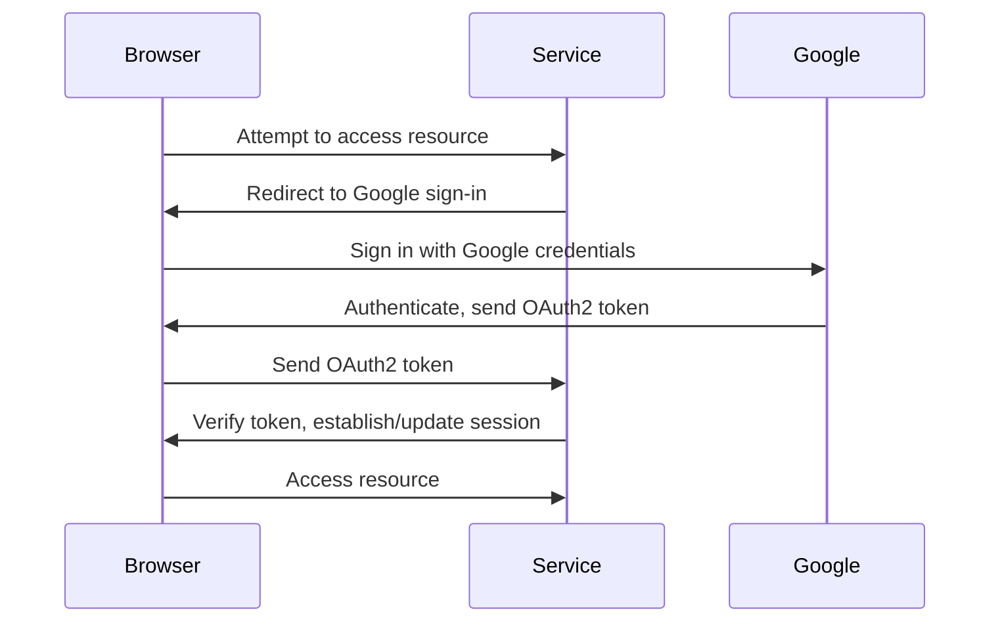

# 🚀 ND-SSO-Service

ND-SSO-Service is a service that provides Single Sign-On (SSO) functionality using Google OAuth2.

## 🔐 How SSO Works

Single Sign-On (SSO) is a user authentication service that permits a user to use one set of login credentials (e.g., name and password) to access multiple applications. The service authenticates the end user for all the applications they have been given rights to and eliminates further prompts when the user switches applications during the same session.

In the context of this project, Google OAuth2 is used to provide SSO functionality. Here's a simplified flow:

1. We attempt to access a resource (e.g., a web page) that requires authentication.
2. We are redirected to the Google sign-in page (since Google is the SSO provider in this case).
3. We sign in with our Google credentials.
4. Google authenticates us and sends an OAuth2 token back to our service.
5. Our service receives the token, verifies it, and either establishes a new session for us or updates an existing session.
6. We are now authenticated and can access the resource.

For additional information, please refer to the following code flow as a pictorial representation



## 📋 Prerequisites

1. Node.js (v14.0 or higher) installed on your machine.
2. Google account with access to Google Cloud Platform.
3. A project set up on Google Cloud Platform with OAuth2.0 Client IDs created.


## 🌐 Google OAuth2 Setup

1. Go to the [Google Cloud Platform Console](https://console.developers.google.com/).
2. Select your project.
3. Navigate to APIs & Services > Credentials.
4. Click on 'Create Credentials' and select 'OAuth client ID'.
5. Configure the OAuth consent screen. (Refer to [this guide](https://support.google.com/cloud/answer/6158849) for help)
6. For 'Application type', select 'Web application'.
7. Enter the authorized JavaScript origins and redirect URIs. (Refer to [this guide](https://developers.google.com/identity/protocols/oauth2/web-server#creatingcred) for help)
8. Click 'Create'. Note down the Client ID and Client Secret.

## 🛠️ Setup

1. Clone the repository: 

```bash
git clone https://github.com/navadhiti/nd-sso-service.git
cd nd-sso-service
```

2. Install the dependencies: 

```bash
npm ci
```

3. Set the environment variables:

```bash
cp .env.example .env

# open .env and modify the environment variables
```

## ⚙️ Configuring the Application

1. In the project directory, you should already have a `.env` file created during the setup process. If not, create one.

2. Open the `.env` file in your text editor. Replace `<Your Google Client ID>`, `<Your Google Client Secret>`, and `<Your Redirect URL>` with your actual values. These values are needed for the application to authenticate with Google's OAuth service.

    - `CLIENT_ID` and `CLIENT_SECRET` are provided by Google when you register your application in the Google Cloud Console.
    - `CALLBACK_URL` is the URL where Google will redirect the user after they have authenticated. This should be a route in your application that handles OAuth callbacks.

2. Save the `.env` file. The application will load these environment variables when it starts, and they will be used to configure the Google OAuth client.

## 🚀 Running the Application

Running locally:

```bash
npm run dev
```

Running in production:

```bash
npm run start
```

Linting:

```bash
# run ESLint
npm lint

# fix ESLint errors
npm lint-fix

# run prettier
npm prettier

# fix prettier errors
npm prettier-fix
```

## 📁 Project Structure

```
.
├── apps\           # Application logic for different parts of our project
│   ├── auth\       # Controller, route and models(if required) for authentication
│   │   ├── auth.controller.ts
│   │   └── auth.route.ts
│   ├── domain\     # Controller and route for domain
│   │   ├── domain.controller.ts
│   │   └── domain.route.ts
│   └── user\       # Controller and route for user
│       ├── user.controller.ts
│       └── user.route.ts
├── config\         # Environment variables and configuration related things
├── lib\            # Utility files for our application
├── scripts\        # Linting and Prettier configuration related things
├── types\          # Custom typescript types for global usage
├── data\           # Store JSON realated files
├── views\          # Templates
├── index.ts\       # App entry point
├── route.ts\       # Defines the main routes for our application

```

## 📖 API Documentation

To view the list of available APIs and their specifications, run the server and go to `http://localhost:5000/v1/docs` in your browser. This documentation page is automatically generated using the [swagger](https://swagger.io/) definitions written as comments in the route files.

### 🌐 API Endpoints

List of available routes:

**User routes**:\
`GET /v1/domains/` - get domains

## 🗒️ Logging

Import the logger from `lib/logger.js`. It is using the [Winston](https://github.com/winstonjs/winston) logging library.

Logging should be done according to the following severity levels (ascending order from most important to least important):

```javascript
const logger = require('<path to root>/lib/logger');

logger.error('message'); // level 0
logger.warn('message'); // level 1
logger.info('message'); // level 2
logger.http('message'); // level 3
logger.verbose('message'); // level 4
logger.debug('message'); // level 5
```

In development mode, log messages of all severity levels will be printed to the console.

In production mode, only `info`, `warn`, and `error` logs will be printed to the console.\
It is up to the server (or process manager) to actually read them from the console and store them in log files.\
This app uses pm2 in production mode, which is already configured to store the logs in log files.

Note: API request information (request url, response code, timestamp, etc.) are also automatically logged (using [morgan](https://github.com/expressjs/morgan)).

